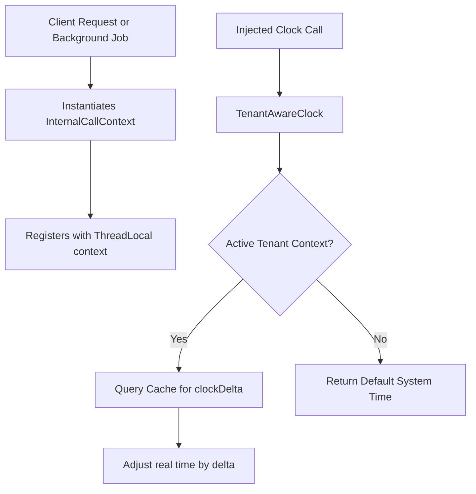

# Kill Bill Per-Tenant Clock Support

This document details the implementation of [Kill Bill Issue #294](https://github.com/killbill/killbill/issues/294): "Support a per-tenant clock".

## Architectural Design

Instead of a disruptive, high-risk refactoring of all ~1,000 injection sites of the `Clock` interface across the multi-module codebase, we designed and implemented a **Tenant-Aware Dynamic Delegation Clock**. This approach provides robust, high-performance per-tenant clock support with zero disruption to the existing API structure.



---

## Key Components

### 1. `TenantAwareClock`
Located at `org.killbill.billing.util.glue.TenantAwareClock`, this class implements the `org.killbill.clock.Clock` interface and delegates to a default system clock (`DefaultClock`).
- It automatically detects the active tenant context using a thread-local context.
- If a tenant context is active, it retrieves the clock delta (in milliseconds) from the high-performance `CacheType.TENANT_KV` cache.
- It returns shifted `DateTime` and `LocalDate` values based on this delta.

### 2. Thread-Local Context Management
In `InternalTenantContext` (`org.killbill.billing.callcontext.InternalTenantContext`), we added a `ThreadLocal` tracker:
```java
private static final ThreadLocal<InternalTenantContext> threadLocalContext = new ThreadLocal<>();
```
- Every time an `InternalTenantContext` or its subclass `InternalCallContext` is constructed, it automatically registers itself to the active thread via `setContext(this)`.
- In `KillbillMDCInsertingServletFilter`, we added cleanups in both `commit()` and `failure()` of the response writer adapter to call `InternalTenantContext.clearContext();`, eliminating any risk of thread-local memory leaks.

### 3. Integrated Caching and Multi-Node Broadcast Invalidation
To achieve sub-microsecond lookup speeds, we mapped the clock delta key to use the existing `TenantKVCacheLoader` out of the box with zero custom caching code:
- The clock delta key is defined as `PLUGIN_CONFIG_clockDelta`.
- Since it begins with `PLUGIN_CONFIG_`, the caching mechanism automatically recognizes it as a system-cached key and populates it in the `tenant-kv` cache.
- Any updates or deletions of the `PLUGIN_CONFIG_clockDelta` key on any Kill Bill node automatically broadcast cache invalidation messages to all other clustered nodes.

### 4. Automatic Multi-Tenant Background Process Awareness
Since background processes (e.g. `PaymentJanitor`, `NotificationQueue` consumers, parent commitment notifications) always construct an `InternalCallContext` matching the tenant they are running for, they automatically register their tenant on the executing thread.
Consequently, any clock check within these background execution flows seamlessly uses the correct per-tenant shifted clock without requiring code changes.

---

## Validation and Tests

We verified our implementation by creating a TestNG unit test `TestTenantAwareClock` under the `killbill-util` test module. This test validates the entire delta lookup, shifting logic, and fallback behaviors:

```bash
[INFO] Running org.killbill.billing.util.glue.TestTenantAwareClock
[INFO] Tests run: 2, Failures: 0, Errors: 0, Skipped: 0, Time elapsed: 0.136 s -- in org.killbill.billing.util.glue.TestTenantAwareClock
[INFO] Results:
[INFO] Tests run: 2, Failures: 0, Errors: 0, Skipped: 0
[INFO] BUILD SUCCESS
```
